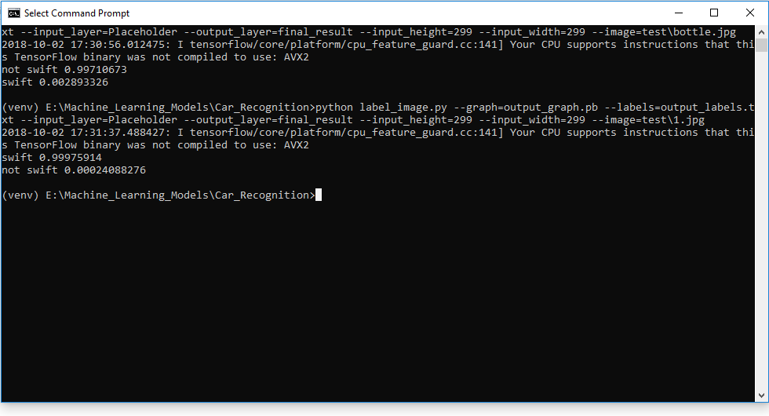

# CarRecognition
Tells whether the car is Maruti Suzuki Swift or not.

Steps:
1. Download or clone this repo.
2. In command prompt or terminal(whatever you use), browse inside the file location of this repo.
3. type this code:<br>
```
    python label_image.py --graph=output_graph.pb --labels=output_labels.txt --input_layer=Placeholder --output_layer=final_result --input_height=299 --input_width=299 --image='full location of image without quotes' e.g. C:/Cars/1.jpg
```
4. You will get results like this:<br>
```
    swift 0.98209894 (if the image provided is of a Swift Car then you will get higher percentage in front of swift label)
    not swift 0.017901093 (and lower percentage in front of not swift label)
```

<br>
<br>
5. Hence the model is running perfectly and is able to describe whether the car is Swift or not.
